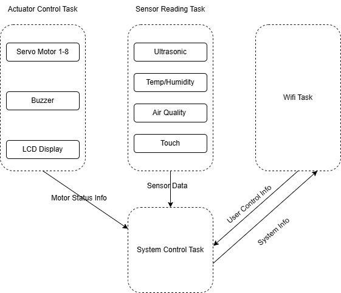
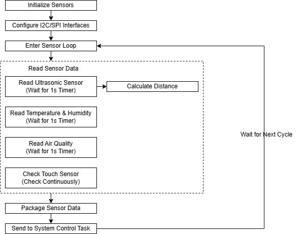
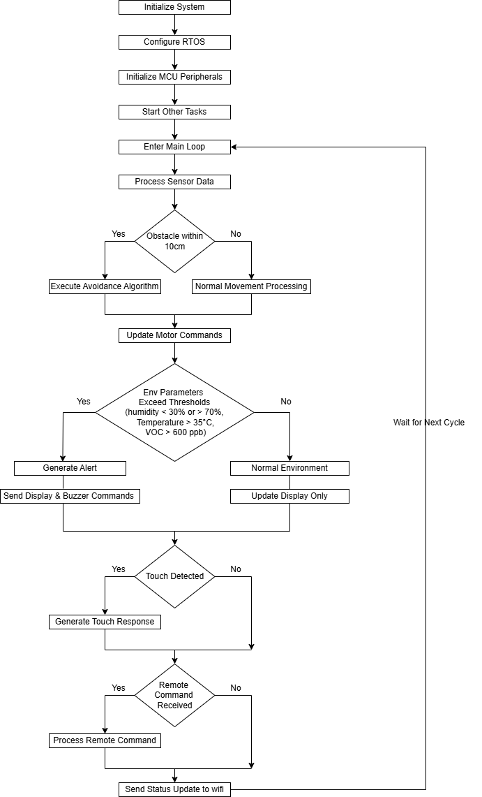
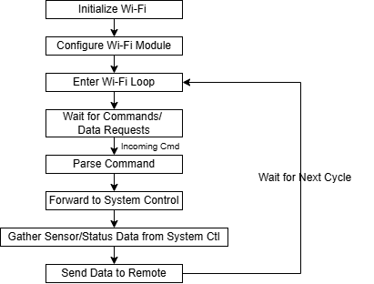

# a07g-exploring-the-CLI

* Team Number: T22
* Team Name: X&Y Circuiteers
* Team Members: Xiran Hu, Yuner Zhang
* GitHub Repository URL: https://github.com/ese5160/final-project-a07g-a14g-t22-x-y-circuiteers.git
* Description of test hardware: (development boards, sensors, actuators, laptop + OS, etc) The laptop, SAM W25 Xplained Pro development board.

## Software Architecture
### 1. Hardware Requirements Specification (HRS)

#### 1.1 Overview
This project aims to create a robotic pet designed for emotional companionship. It uses the microcontroller for Wi-Fi connectivity and includes ultrasonic, temperature&humidity, and air quality sensors for environment monitoring and obstacle detection. Eight servo motors provide precise movement and posture control, while touch sensors, an LCD display, and a buzzer enable user interaction. Powered by the Li-ion battery with a power management module, the robot ensures efficient and stable operation. 

---

#### 1.2 Definitions and Abbreviations
- **MCU**: Microcontroller Unit  
- **LCD**: Liquid Crystal Display  
- **I2C**: Inter-Integrated Circuit (serial communication protocol)  
- **PWM**: Pulse Width Modulation   
- **SAMW25**: Microcontroller model with Wi-Fi and multiple interfaces  
- **VOCs**: Volatile Organic Compounds 

---

#### 1.3 Functionality

##### **HRS 01 – Core Microcontroller**
- The system shall use the microcontroller, supporting Wi-Fi communication and multiple peripheral interfaces such as I2C, SPI, UART, and PWM to enable functionality expansion.

##### **HRS 02 – Ultrasonic Sensor**
- The device shall support obstacle detection and avoidance, with a detection range of **10 cm to 25 cm**, suitable for indoor environments.

##### **HRS 03 – Temperature and Humidity Sensor**
- The device shall monitor room temperature and humidity, covering a range of **20°C to 40°C** for temperature and **0% to 100%** for humidity. 

##### **HRS 04 – Air Quality Sensor**
- The device shall monitor indoor air quality by detecting VOCs.

##### **HRS 05 – Touch Sensor**
- The device shall detect user touch or pressure on the robot’s body and trigger corresponding actions.  
   
##### **HRS 06 – LCD Display**
- The device shall display real-time feedback on the screen:
  - Environmental data (temperature, humidity, and air quality).  
  - Robot status (e.g., movement state).  
  - Distance to obstacles.  
   
##### **HRS 07 – Buzzer** 
- The device shall provide audio notifications (e.g., environment alerts).  
   

##### **HRS 08 – Servo Motors**
- The system shall include **8 servo motors**,  each controlled via PWM signals and connected to a driver board. This configuration enables multi-degree-of-freedom movement and posture adjustments.

##### **HRS 09 – Power System**
- The system shall use a **Volatile Organic Compounds Li-Ion battery**  with the following modules:  
  - **Boost Circuit** to step up the voltage to 5V for servos and the LCD display.
  - **Buck Circuit** to step down the voltage to 3.3V for other components.

##### **HRS 10 – Structure and Materials**
- The robot’s casing shall use lightweight yet durable materials (e.g., PMMA acrylic and 3D-printed components).  
- The design shall ensure flexibility and stability of the four-leg structure, with a total weight not exceeding 4 kg. 
 

### 2. Software Requirements Specification (SRS)

#### 2.1 Overview
The software enables interactive control of the robotic pet, supporting movement, obstacle detection, environmental monitoring, touch response, and real-time user interface management. It runs on an RTOS, ensuring efficient data collection, Wi-Fi communication, and SD card logging.

---

#### 2.2 Users  
The target users are individuals who require emotional companionship, such as children, elderly people, and those living alone.

---

#### 2.3 Definitions and Abbreviations
- **Wi-Fi**: Wireless communication protocol for synchronizing status and sending commands via computer.  
- **UI**: User Interface, used for displaying status information and interacting with users.  
- **RTOS**: Real-Time Operating System, used to manage task scheduling and resource allocation.  

---

#### 2.4 Functionality

##### **SRS 01 – Servo Motor Control**  
- The software shall generate PWM signals to control the 8 servo motors.  
- Control signals shall be updated at least every **50ms**, supporting various predefined motion patterns (e.g., walking, turning, and playful gestures).

##### **SRS 02 – Obstacle Detection and Avoidance**  
- The software shall sample distance data from the ultrasonic sensor every **1s**, with a precision of **±0.1 cm**.  
- If an obstacle is detected within **10 cm**, the avoidance algorithm shall adjust the robot’s trajectory to prevent collisions.

##### **SRS 03 – Environmental Data Processing and Alerts**  
- The software shall collect environmental data, including temperature, humidity, and air quality readings, at least every **1 second**.  
- If any measured parameter exceeds predefined thresholds (e.g., **humidity < 30% or > 70%**, **Temperature > 35°C**, **VOC > 600 ppb** ), the system shall:  
  - Notify the user with a buzzer alert.  
  - Display a message on the screen (e.g., “Current humidity: XX%. The room is dry, please drink more water.”).  

##### **SRS 04 – Touch Response**   
- Upon detecting a touch, the robot shall perform a corresponding action, such as body shaking or displaying an emotion.

  
##### **SRS 05 – Communication and Remote Control**  
- The software shall communicate with a computer via Wi-Fi and perform the following functions:  
  - **Data Upload**: Synchronize environmental data and robot status with the computer every **1 second**.  
  - **Control Commands**: Execute remote commands for basic movements and special actions.  

---

### 3. Block Diagram

### 4. Flowcharts
#### Sensor Reading Task Flowchart
 
#### System Control Task Flowchart
 
#### Wi-Fi Task Flowchart
 
