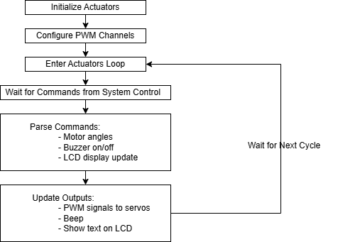
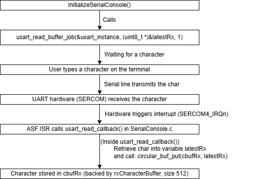
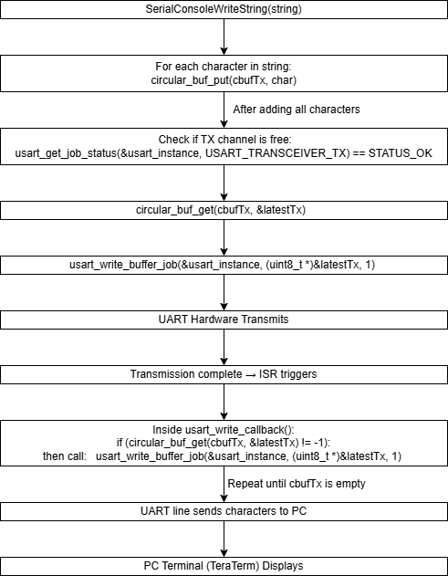
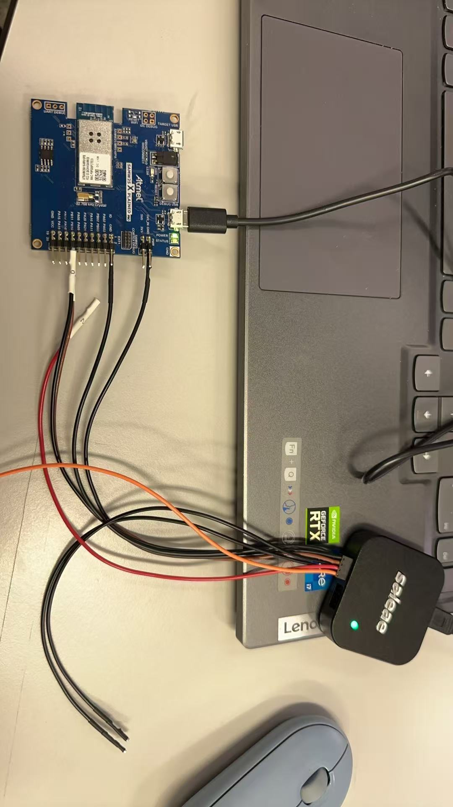
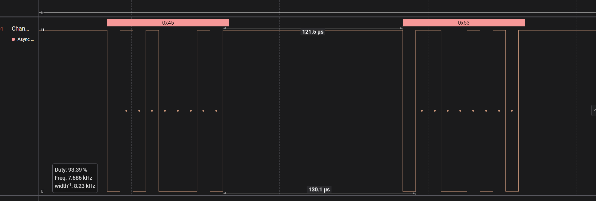
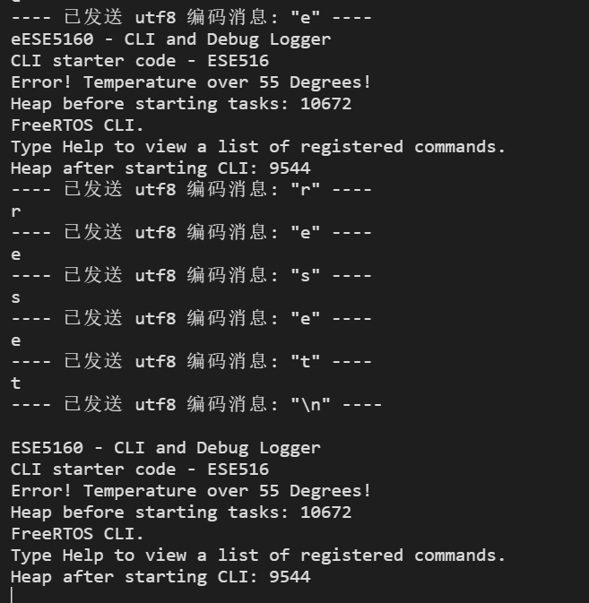
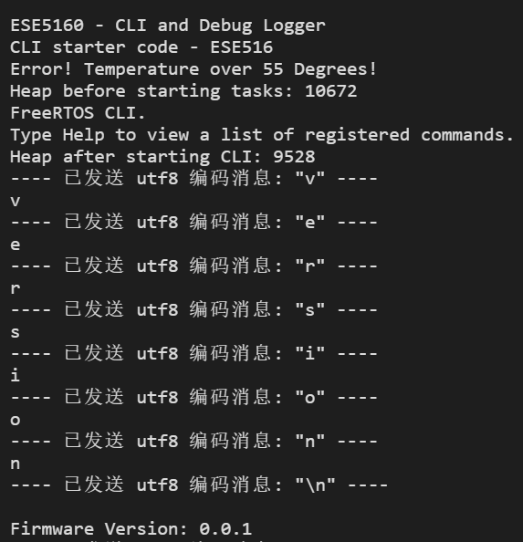

# a07g-exploring-the-CLI

* Team Number: T22
* Team Name: X&Y Circuiteers
* Team Members: Xiran Hu, Yuner Zhang
* GitHub Repository URL: https://github.com/ese5160/final-project-a07g-a14g-t22-x-y-circuiteers.git
* Description of test hardware: (development boards, sensors, actuators, laptop + OS, etc) The laptop, SAM W25 Xplained Pro development board.

## Software Architecture
### 1. Hardware Requirements Specification (HRS)

#### 1.1 Overview
This project aims to create a robotic pet designed for emotional companionship. It uses the microcontroller for Wi-Fi connectivity and includes ultrasonic, temperature&humidity, and air quality sensors for environment monitoring and obstacle detection. Eight servo motors provide precise movement and posture control, while touch sensors, an LCD display, and a buzzer enable user interaction. Powered by the Li-ion battery with a power management module, the robot ensures efficient and stable operation. 

---

#### 1.2 Definitions and Abbreviations
- **MCU**: Microcontroller Unit  
- **LCD**: Liquid Crystal Display  
- **I2C**: Inter-Integrated Circuit (serial communication protocol)  
- **PWM**: Pulse Width Modulation   
- **SAMW25**: Microcontroller model with Wi-Fi and multiple interfaces  
- **VOCs**: Volatile Organic Compounds 

---

#### 1.3 Functionality

##### **HRS 01 – Core Microcontroller**
- The system shall use the microcontroller, supporting Wi-Fi communication and multiple peripheral interfaces such as I2C, SPI, UART, and PWM to enable functionality expansion.

##### **HRS 02 – Ultrasonic Sensor**
- The device shall support obstacle detection and avoidance, with a detection range of **10 cm to 25 cm**, suitable for indoor environments.

##### **HRS 03 – Temperature and Humidity Sensor**
- The device shall monitor room temperature and humidity, covering a range of **20°C to 40°C** for temperature and **0% to 100%** for humidity. 

##### **HRS 04 – Air Quality Sensor**
- The device shall monitor indoor air quality by detecting VOCs.

##### **HRS 05 – Touch Sensor**
- The device shall detect user touch or pressure on the robot’s body and trigger corresponding actions.  
   
##### **HRS 06 – LCD Display**
- The device shall display real-time feedback on the screen:
  - Environmental data (temperature, humidity, and air quality).  
  - Robot status (e.g., movement state).  
  - Distance to obstacles.  
   
##### **HRS 07 – Buzzer** 
- The device shall provide audio notifications (e.g., environment alerts).  
   

##### **HRS 08 – Servo Motors**
- The system shall include **8 servo motors**,  each controlled via PWM signals and connected to a driver board. This configuration enables multi-degree-of-freedom movement and posture adjustments.

##### **HRS 09 – Power System**
- The system shall use a **Volatile Organic Compounds Li-Ion battery**  with the following modules:  
  - **Boost Circuit** to step up the voltage to 5V for servos and the LCD display.
  - **Buck Circuit** to step down the voltage to 3.3V for other components.

##### **HRS 10 – Structure and Materials**
- The robot’s casing shall use lightweight yet durable materials (e.g., PMMA acrylic and 3D-printed components).  
- The design shall ensure flexibility and stability of the four-leg structure, with a total weight not exceeding 4 kg. 
 

### 2. Software Requirements Specification (SRS)

#### 2.1 Overview
The software enables interactive control of the robotic pet, supporting movement, obstacle detection, environmental monitoring, touch response, and real-time user interface management. It runs on an RTOS, ensuring efficient data collection, Wi-Fi communication, and SD card logging.

---

#### 2.2 Users  
The target users are individuals who require emotional companionship, such as children, elderly people, and those living alone.

---

#### 2.3 Definitions and Abbreviations
- **Wi-Fi**: Wireless communication protocol for synchronizing status and sending commands via computer.  
- **UI**: User Interface, used for displaying status information and interacting with users.  
- **RTOS**: Real-Time Operating System, used to manage task scheduling and resource allocation.  

---

#### 2.4 Functionality

##### **SRS 01 – Servo Motor Control**  
- The software shall generate PWM signals to control the 8 servo motors.  
- Control signals shall be updated at least every **50ms**, supporting various predefined motion patterns (e.g., walking, turning, and playful gestures).

##### **SRS 02 – Obstacle Detection and Avoidance**  
- The software shall sample distance data from the ultrasonic sensor every **1s**, with a precision of **±0.1 cm**.  
- If an obstacle is detected within **10 cm**, the avoidance algorithm shall adjust the robot’s trajectory to prevent collisions.

##### **SRS 03 – Environmental Data Processing and Alerts**  
- The software shall collect environmental data, including temperature, humidity, and air quality readings, at least every **1 second**.  
- If any measured parameter exceeds predefined thresholds (e.g., **humidity < 30% or > 70%**, **Temperature > 35°C**, **VOC > 600 ppb** ), the system shall:  
  - Notify the user with a buzzer alert.  
  - Display a message on the screen (e.g., “Current humidity: XX%. The room is dry, please drink more water.”).  

##### **SRS 04 – Touch Response**   
- Upon detecting a touch, the robot shall perform a corresponding action, such as body shaking or displaying an emotion.

  
##### **SRS 05 – Communication and Remote Control**  
- The software shall communicate with a computer via Wi-Fi and perform the following functions:  
  - **Data Upload**: Synchronize environmental data and robot status with the computer every **1 second**.  
  - **Control Commands**: Execute remote commands for basic movements and special actions.  

---

### 3. Block Diagram

### 4. Flowcharts
#### Sensor Reading Task Flowchart
 
#### System Control Task Flowchart
 
#### Wi-Fi Task Flowchart
 
#### Actuator Control Task Flowchart
 

## Understanding the Starter Code
#### 1. What does “InitializeSerialConsole()” do? In said function, what is “cbufRx” and “cbufTx”? What type of data structure is it? 
- `InitializeSerialConsole()` sets up the UART by:
    - Initializes two circular buffers for handling UART communication:
        - `cbufRx`: Buffer for receiving incoming characters
        - `cbufTx`: Buffer for characters to be transmitted
    - Configuring USART: It sets the baud rate, pin multiplexing, and other USART settings.
    - Registering callbacks: It registers asynchronous callbacks for UART read and write operations.
    - Starting the read process: It initiates a read job so that incoming characters are continuously captured.

- `cbufRx` and `cbufTx` are circular buffers implemented using a structure (`circular_buf_t`) that contains:
    - A pointer to the buffer array.
    - Head and tail indices.
    - Maximum capacity.
    - A flag to indicate if the buffer is full.

#### 2. How are “cbufRx” and “cbufTx” initialized? Where is the library that defines them (please list the *C file they come from). 
- Both buffers are initialized using the `circular_buffer_init()` function.
- The circular buffer implementation is defined in `circular_buffer.c`, located in src/SerialConsole/circular_buffer.c.

#### 3. Where are the character arrays where the RX and TX characters are being stored at the end? Please mention their name and size.
The RX characters are stored in `rxCharacterBuffer` and the TX characters in `txCharacterBuffer`. Both arrays have a size of 512 bytes as defined by `RX_BUFFER_SIZE` and `TX_BUFFER_SIZE` respectively.

#### 4. Where are the interrupts for UART character received and UART character sent defined? 
The UART receive and transmit interrupts are handled via callback functions defined in `SerialConsole.c`:
- `usart_read_callback` is registered for the "buffer received" event (UART character received).
- `usart_write_callback` is registered for the "buffer transmitted" event (UART character sent).
These callbacks are registered and enabled in the `configure_usart_callbacks()` function using the ASF functions `usart_register_callback()` and `usart_enable_callback()`.

#### 5. What are the callback functions that are called when: a. A character is received? (RX) b. A character has been sent? (TX) 
Like above, for received characters (RX), the callback function is `usart_read_callback`. For transmitted characters (TX), the callback function is `usart_write_callback`. These functions are registered in the `configure_usart_callbacks()` function in `SerialConsole.c`.

#### 6. Explain what is being done on each of these two callbacks and how they relate to the cbufRx and cbufTx buffers. 
- `usart_read_callback`:
    - Invoked when a character is received.
    - It reads the character (stored in latestRx) and adds it to the RX circular buffer (cbufRx), then typically re-initiates another read.

- `usart_write_callback`:
    - Invoked after a character is sent.
    - It fetches the next character from the TX circular buffer (cbufTx) and initiates its transmission, continuing until the buffer is empty.

- The relationship with the circular buffers:
    - `cbufRx`: Acts as a FIFO queue for received characters, allowing the main program to read them later using `SerialConsoleReadCharacter()`.
    - `cbufTx`: Acts as a FIFO queue for characters to be transmitted, processed one at a time by the transmit callback.

#### 7. Draw a diagram that explains the program flow for UART receive – starting with the user typing a character and ending with how that characters ends up in the circular buffer “cbufRx”. Please make reference to specific functions in the starter code. 
 

#### 8. Draw a diagram that explains the program flow for the UART transmission – starting from a string added by the program to the circular buffer “cbufTx” and ending on characters being shown on the screen of a PC (On Teraterm, for example). Please make reference to specific functions in the starter code. 
 

#### 9. What is done on the function “startStasks()” in main.c? How many threads are started?
`StartTasks()` prints the available heap size, creates the CLI task using FreeRTOS's xTaskCreate(), and then prints the updated heap size. Only one thread (the CLI task) is started in this function.

## Debug Logger Module
We placed the Debug Logger Module in `SerialConsole.c` file with the `LogMessage()` function added. The updated code has already been committed to the GitHub repo.

## Wiretap the convo
### Answer Questions
#### 1. What nets must you attach the logic analyzer to? (Check how the firmware sets up the UART in SerialConsole.c!)
- The pinmux settings (e.g., `pinmux_pad2`, `pinmux_pad3`) map to TX and RX lines.
- PB10 (SERCOM4 PAD2) and PB11 (SERCOM4 PAD3) are used for the EDBG UART lines.
- #define EDBG_CDC_SERCOM_PINMUX_PAD2 PINMUX_PB10D_SERCOM4_PAD2
- #define EDBG_CDC_SERCOM_PINMUX_PAD3 PINMUX_PB11D_SERCOM4_PAD3

#### 2. Where on the circuit board can you attach / solder to?
- PB10 (TX), PB11 (RX)

#### 3. What are critical settings for the logic analyzer?
- Protocol: UART (async serial)
- Baud: 115200 (8N1)
- Voltage: 3.3 V
- Sample Rate: ~4× baud rate (e.g., 500 kS/s).

### Photo of Hardware Connections
 
### Screenshot of Decoded Message
 
### Capture File
The capture file is available in the GitHub repo: A07G\Session 0.sal.

## Complete the CLI
- The updated CLI code has already been committed to the GitHub repo.
 

## Add CLI commands
- The updated CLI code has already been committed to the GitHub repo.
- You can find the video in the GitHub repo: A07G\CLI_Video. You can check it through the [Google Drive link](https://drive.google.com/file/d/1Hw9iqbLmp7xXRjGftwgZRFhNBUX6lBS_/view?usp=drive_link).
 